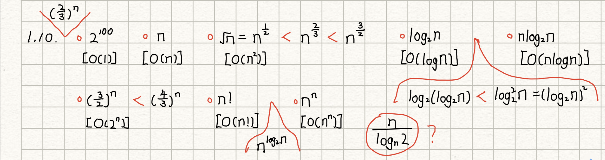

# NEU DSA HM
# HM1(20220923)

1. 1.4

``` C
//复数书中示例基本齐全，照着重复写了一遍
ADT Complex{
	数据对象：D={e1,e2|e1,e2为实数}
	数据关系：R={<e1,e2>}
	基本操作：
		Create(&C,x,y)
            操作结果：构造复数C，其实部和虚部分别被赋以参数e1和e2的值。
	}ADT Complex

//有理数
ADT RationalNumber{
	数据对象：D={e1,e2|e1,e2为自然数，且e2不为0}
	数据关系：R={<e1,e2>}
	基本操作：
		InitRationalNumber(&R,x,y)
            操作结果：构造有理数R，其分子和分母分别为x和y
	}ADT RationalNumber
```

2. 1.6
* 1. exit语句终止执行，优点在于适用于不退出会出现严重错误的情况下能避免出更大的问题；缺点是用户体验不好，如果每个错误都exit，那软件就动不动闪退，用户体验很差
* 2. 用函数的返回值区别，优点在于适用于可根据返回值不断调整正确输入，以输出约束输入内容是否合法，规范性强；缺点是错误返回值可能太多，导致得专门列出持续更新，否则难以判断程序容易出BUG
* 3. 设置一个整型变量的函数参数以区别，优点在于相对第二种方法区分正确返回或某种错误返回更容易些，各种函数都可以添加这种方法，比较灵活；缺点是实现起来有些麻烦（个人觉得）

3. 1.7
* 1. 通过scanf和printf语句，优点在于简单直观，可进行人机交互，想输入什么输出什么随时调用即可；缺点是需要规范调用，格式化输入输出，若有问题易引起程序BUG
* 2. 通过函数的参数显式传递，优点在于信息隐藏，减少出错的可能性；缺点我自己不太清楚。
* 3. 通过全局变量隐式传递，优点在于非常方便，修改容易；缺点是全局变量多会增加程序耦合度，导致程序难维护，这学期软件架构与设计模式这门课老师刚讲，全局变量就是垃圾，能不用就不要用

4. 1.10

最后一个n/logn2不知道如何处理，放哪里合适

5. 1.14
基本都不会精确比较，是只凭感觉在猜，可能需要用到高数求极限思想？已经忘了，悲
* 1. g(n)
* 2. g(n)
* 3. f(n)
* 4. f(n)

6. 1.16
``` C
int Sort(int x, int y, int z){
    if(x > y){
        if(x > z){
            return x;
        }else{
            return z;
        }
    }else{
        if(y > z){
            return y;
        }else{
            return z;
        }
    }
}
```

7. 1.19
``` C
#include<stdio.h>
#include<stdlib.h>
#define MAXINT 99999
#define ARRSIZE 100

int main(){
	int i,k;
	int arr[ARRSIZE];
    scanf("%d", &k);
	
    if(k > ARRSIZE-1){
        exit(0);
    }

	for(i = 0; i <= k; i++){
		if(i == 0){
            arr[i] = 1;
        }else{
		    if(2 * i * arr[i-1] > MAXINT){
                exit(0);
            }else{
                arr[i] = 2 * i * arr[i-1];
            }
		}
	}
//题目没要求输出，只有存入和判断，有点奇怪
}
```